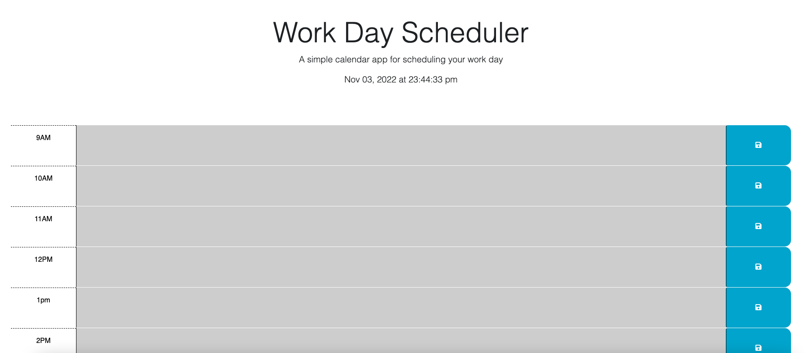

# 05 Third-Party APIs: Work Day Scheduler


## User Story

```md
AS AN employee with a busy schedule
I WANT to add important events to a daily planner
SO THAT I can manage my time effectively
```

## Acceptance Criteria

```md
GIVEN I am using a daily planner to create a schedule
WHEN I open the planner
THEN the current day is displayed at the top of the calendar
WHEN I scroll down
THEN I am presented with timeblocks for standard business hours
WHEN I view the timeblocks for that day
THEN each timeblock is color coded to indicate whether it is in the past, present, or future
WHEN I click into a timeblock
THEN I can enter an event
WHEN I click the save button for that timeblock
THEN the text for that event is saved in local storage
WHEN I refresh the page
THEN the saved events persist
```

##  during this module challenge
I learned more about java script and jquery and how they can work to create a more intuitive site. how to use bootstrap and jquery components. it was also a good challenge for me needing to go through and clean up my code and debug it.

## deployed page & screenshot
https://afredknot.github.io/its-a-calender-eh/
